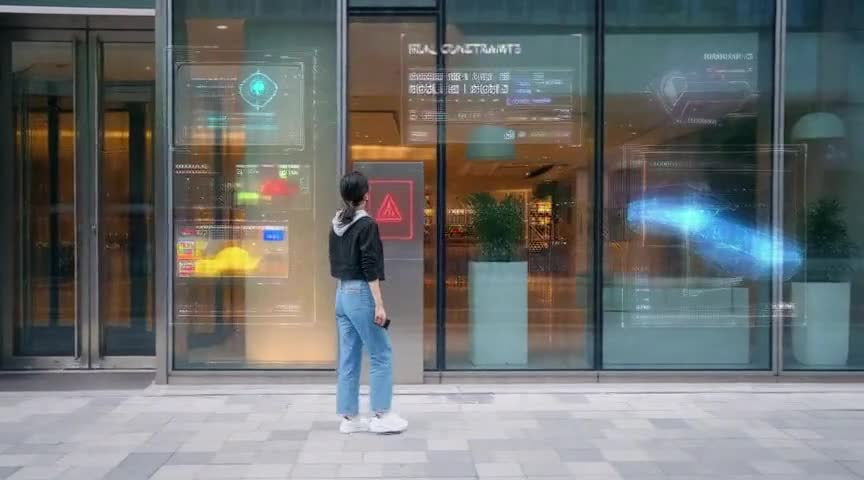
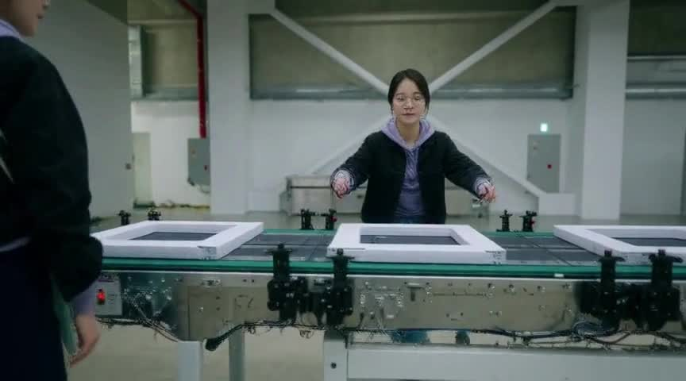

  
  

Switch language / 언어 전환

  
  

Decision case studies, told as judgment / 의사결정 케이스 스터디

# Hi, I'm entangelk

> **Product Planning × AI-Augmented Engineering** 
> My background is in operations, business planning, and data analysis. I turn work problems into product flows, build with AI, and use implementation and experiment evidence to decide what to change or stop.

## Selected product decisions

### [AI Writer System](https://github.com/entangelk/ai_writte_system) · In development

A writing workspace for long-form creators to find earlier settings and events while drafting. **Consistency tracking is the product hypothesis**, so memory retrieval and review sit alongside generation.

Draft → check the source behind a memory suggestion → approve or reject → retrieve it during later writing. Generated prose arrives in a side pad and changes the manuscript only when adopted. Drafting, generation, memory review and retrieval run locally, with recorded screens.

[Experience and implementation evidence](https://entangelk.github.io/entangelk/case-studies.html#writer)

### [Long-Form AI Video Production System](https://entangelk.github.io/entangelk/experience.html#video) · Company project, quality under evaluation

Designed an experience where requesters work with **video intent and scenarios instead of generation workflows**. Reference-image review feeds the generation plan; execution recipes stay internal.

Generation and master assembly run locally. Long-form quality and voice consistency remain unresolved. Source is private.

### [Assessment Spec Harness](https://github.com/entangelk/assessment_poc) · PoC

Checks **mismatches between public assignment instructions and private scoring criteria**. It reviews the assessment design rather than grading candidates, separating automatic findings from human judgment. CLI and AI agents run the checks; assessment designers review the findings.

Deterministic reproducibility was checked on synthetic examples. Live LLM SDK integration remains deferred.

## Decisions in operational work

| Case | Problem and choice | Evidence boundary |
| --- | --- | --- |
| [Customer-center staffing](https://entangelk.github.io/entangelk/experience.html#staffing) | Used Q90 and a conservative option to plan for high-load days hidden by averages | Historical back-testing and staffing rules |
| [Asset generation and review](https://entangelk.github.io/entangelk/experience.html#assets) | Let reviewers compare, regenerate and review outputs, then continue unfinished work | 22,068 unique items in a local generation index; distinct from final approvals or deployment |
| [NLP category matching](https://entangelk.github.io/entangelk/experience.html#nlp) | Connected natural language to existing categories and updated embeddings only for changed data | API integration with managed categories and incremental updates |
| [Internal automation](https://entangelk.github.io/entangelk/experience.html#automation) | Connected repetitive reporting and collection to web tasks with human exception handling | Report generation, editing, export and scheduled execution implemented |

## Technical foundations and research

- **[Verified RAG](https://entangelk.github.io/entangelk/experience.html#rag)** — A technical case in statute retrieval and evidence verification. Live-model experiments and a standalone verification Core exist; the calling service owns final adoption.
- **[Agent Memory System](https://github.com/entangelk/agent-memory-system-public)** — Explored shared memory across AI clients. The canonical-record/search-cache separation carries into AI Writer.
- **[Logo Workbench](https://github.com/entangelk/logo_image)** · **[Harness IR](https://github.com/entangelk/Harness_ir)** — Research into segmentation failures and structured extraction, distinct from validated product outcomes.
- **Constraint-search research series** — [HW-WFC](https://github.com/entangelk/hw-wfc), [Circle-WFC](https://github.com/entangelk/circle-wfc), [T-WFC](https://github.com/entangelk/T-WFC). Recorded tested successes and failure conditions. Corridor generation remains a follow-up hypothesis for Circle-WFC.
- **[Q-PSA](https://github.com/entangelk/Q-PSA_Pr)** — A separate perturbation experiment inspired by WFC. Stopped after layer removal raised PPL 3.65× versus 1.05× for the baseline, with scoring roughly 1,300× slower.

## How I work

Start with the problem and existing task, choose the experience and scope, then build with AI and preserve regression evidence. **Working implementation and user benefit require different evidence.** Connect each product decision to the relevant evidence.

[Decisions and technical evidence — PROJECTS.md](https://github.com/entangelk/entangelk/blob/main/PROJECTS.md)

Intro videos

<table>
<tr>
<td width="50%" valign="top">

**1 minute · ad_ko.mp4**

https://github.com/user-attachments/assets/fb68ad64-1589-4e17-98c4-a67e5231c7d5

</td>
<td width="50%" valign="top">

**3 minutes · Intuitive**

[▶ Watch on Streamable](https://streamable.com/cd9qrk)

</td>
</tr>
</table>

More 1-minute videos

<table>
<tr>
<td width="50%" valign="top">

**English**

https://github.com/user-attachments/assets/9470b845-b59b-41fa-afc7-782c456412b8

</td>
<td width="50%" valign="top">

**1min_v3_master.mp4**

https://github.com/user-attachments/assets/05fddc97-0a09-4347-881d-289cd3fa5aac

</td>
</tr>
</table>

More 3-minute videos

<table>
<tr>
<td width="50%" valign="top">

**Animation**

[▶ Watch on Streamable](https://streamable.com/zsggw4)

</td>
<td width="50%" valign="top">

**Museum**

[▶ Watch on Streamable](https://streamable.com/ygppxr)

</td>
</tr>
<tr>
<td width="50%" valign="top">

**Standard · Version 1**

[▶ Watch on Streamable](https://streamable.com/cqx4s7)

</td>
<td width="50%" valign="top">

**Standard · Version 2**

[▶ Watch on Streamable](https://streamable.com/yejr8a)

</td>
</tr>
</table>

## Contact

**Email:** [kdtyohan@gmail.com](mailto:kdtyohan@gmail.com)  
**LinkedIn:** [entangelk](https://www.linkedin.com/in/entangelk/)
